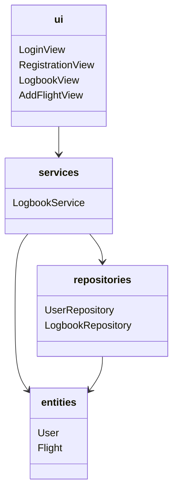
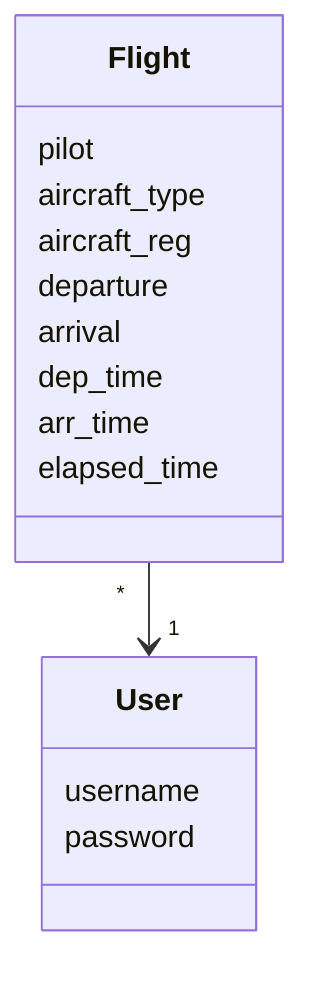
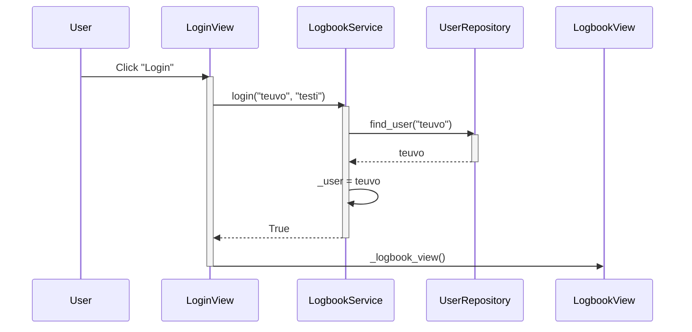
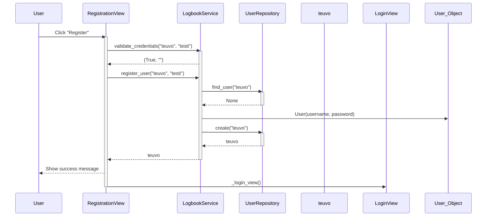
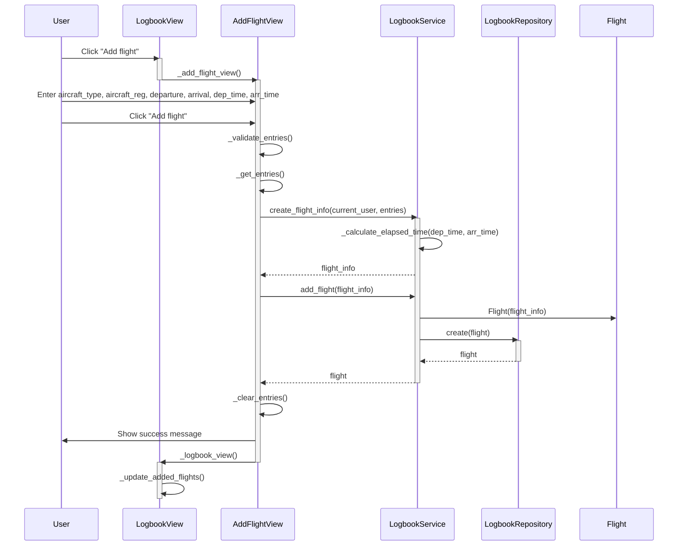

# Arkkitehtuuri

## Rakenne

Seuraava kaavio kuvaa sovelluksen luokka/pakkausrakennetta:

Kaaviossa **ui** vastaa käyttöliittymää ja sen eri näkymiä, **services** sisältää sovelluslogiikan, **repositories** tietokantaoperaatiot jaettuna *käyttäjä-* sekä *lokikirjatoimintoihin* ja **entities** sisältää objektit *User* ja *Flight*, jotka kuvaavat *käyttäjää* ja käyttäjän lentämää *lentoa*.

## Käyttöliittymä

Sovelluksessa on neljä sivua:

 - Kirjautumissivu (etusivu)
 - Rekisteröitymissivu
 - Lokikirjasivu (pääsivu)
 - Lentojen lisäyssivu

Kirjautumissivu on etusivu, josta voi siirtyä kirjautumalla lokikirjasivulle, tai jos haluaa luodan uuden käyttäjän, rekisteröitymissivulle. Lokikirjasivu on perusnäkymä, johon on listattu käyttäjän lisäämät lennot. Lokikirjasivulta voi siirtyä lentojen lisäysnäkymään, jossa käyttäjä voi lisätä uuden lennon. Näille jokaiselle on oma luokkansa.

## Sovelluslogiikka

Sovelluksen oleellisimmat luokat ovat [User](https://github.com/ilmari21/ot-harjoitustyo/blob/master/src/entities/user.py) ja [Flight](https://github.com/ilmari21/ot-harjoitustyo/blob/master/src/entities/flight.py). *User* kuvaa käyttäjää, ja *Flight* käyttäjän lentämää lentoa:

Sovelluslogiikan toiminta toteutuu [LogbookService](https://github.com/ilmari21/ot-harjoitustyo/blob/master/src/services/logbook_service.py)-luokan kautta.

## Päätoiminnallisuudet

### Sisäänkirjautuminen

Tämä sekvenssikaavio kuvaa sisäänkirjautumista, ja sen alta löytyy tarkempi kuvaus tapahtumista:

Kirjautumissivulla käyttäjä syöttää käyttäjätunnuksen ja salasanan, jonka jälkeen klikataan "Login"-painiketta. Tämä kutsuu `LogbookService`:n metodia `login`, joka kutsuu `UserRepository`:n metodia `find_user` löytääkseen käyttäjänimen ja sitä vastaavan salasanan. Jos käyttäjä löytyy, ja käyttäjänimi ja salasana täsmäävät, vaihtaa `LogbookService` tämän nykyiseksi käyttäjäksi, ja palauttaa tiedon onnistumisesta `LoginView`:lle. Tämä puolestaan vaihtaa näkymän lokikirjanäkymään.

### Uuden käyttäjän rekisteröiminen

Tämä sekvenssikaavio kuvaa käyttäjän rekisteröimistä, ja sen alta löytyy tarkempi kuvaus tapahtumista:

Rekisteröitymissivulla käyttäjä syöttää käyttäjätunnuksen sekä salaasanan ja klikkaa **"Register"**-painiketta. Tämä kutsuu `LogbookService`:n metodia `validate_credentials`, joka tarkistaa syötteet. Jos tarkistuksen menevät läpi, kutsutaan `LogbookService`:n metodia `register_user`. `LogbookService` kutsuu `UserRepository`:n metodia `find_user` jonka tarkoitus on varmistaa, ettei kyseinen käyttäjätunnus ole vielä käytössä. Jos käyttäjätunnus on vapaa, `UserRepository`:n metodi `create` luo uuden käyttäjän ja lisää sen tietokantaan. Tämän jälkeen tieto palautetaan `LogbookService`:lle ja siitä edelleen `RegistrationView`:lle, joka antaa käyttäjälle ilmoituksen siitä että uusi käyttäjä on luotu onnistuneesti ja siirtyy kirjautumissivulle.

### Lentojen lisääminen

Tämä sekvenssikaavio kuvaa lentojen lisäämistä, ja sen alta löytyy tarkempi kuvaus tapahtumista:

Kun lokikirjasivulla painetaan **"Add flight"**-painiketta, kutsutaan metodia `show_add_flight` näkymän vaihtamiseksi jotta lento voidaan lisätä. Käyttäjä syöttää lentokoneen tyypin, rekisteritunnuksen, lähtö- ja saapumiskentän, sekä lähtö- ja saapumisajat, ja painaa **"Add flight"**-painiketta, joka tarkistettuaan syötteen kutsuu `LogbookService`:n metodia `create_flight_info`. Tämä metodi lisää annettujen syötteiden lisäksi lentäjän ja lentoajan, ja palauttaa lennon tiedot sanakirjana. Tämän jälkeen sanakirja annetaan `LogbookService`n metodille add_flight, joka puolestaan tarkistaa onko kirjauduttu sisään, eli onko käyttäjä olemassa, ja luo `Flight`-olion. Tämän jälkeen se kutsuu `LogbookRepository`:n `create`-metodia, joka tallettaa lennon tietokantaan. Tämä palauttaa tiedon `LogbookService`:lle ja siitä edelleen `AddFlightView`:lle, joka tyhjentää syötteet, antaa käyttäjälle ilmoituksen siitä että uusi lento on lisätty ja vaihtaa näkymän takaisin lokikirjanäkymään. `LogbookView` vielä päivittää listan käyttäjän lentämistä lennoista metodilla `update_added_flights`.

## Tietojen talletus

`LogbookService` käyttää repositorioita [LogbookRepository](https://github.com/ilmari21/ot-harjoitustyo/blob/master/src/repositories/logbook_repository.py) ja [UserRepository](https://github.com/ilmari21/ot-harjoitustyo/blob/master/src/repositories/user_repository.py), jotka tallettavat tiedot sovelluksen [data](https://github.com/ilmari21/ot-harjoitustyo/blob/master/data)-hakemistossa olevaan SQLite-tietokantaan. Tietokannan taulut ovat `flights` ja `users`. `LogbookRepository` vastaa lentojen tietokantaoperaatioista, `UserRepository` puolestaan käyttäjiin liittyvistä tietokantaoperaatioista. Testauksessa käytetään muistissa olevaa tietokantaa.

## Huomioitavaa

Sovelluksen syötteiden suuren määrän vuoksi oli valittava pitkien metodien ja useiden apumetodien välillä, joka joissakin kohdissa osoittautui ongelmalliseksi koodin siistinä pitämisen kannalta.
