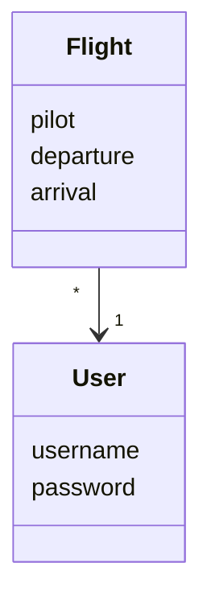

# Arkkitehtuuri

## Käyttöliittymä

Sovelluksessa on kolme sivua:

 - Kirjautumissivu
 - Rekisteröitymissivu
 - Pääsivu

Kirjautumissivu on etusivu, josta voi siirtyä kirjautumalla pääsivulle, tai jos haluaa luodan uuden käyttäjän, rekisteröitymissivulle. Pääsivulla voi lisätä uusia lentoja.

## Sovelluksen logiikka

Sovelluksen oleellisimmat luokat ovat *User* ja *Flight*. *User* kuvaa käyttäjää, ja *Flight* käyttäjän lentämää lentoa:

