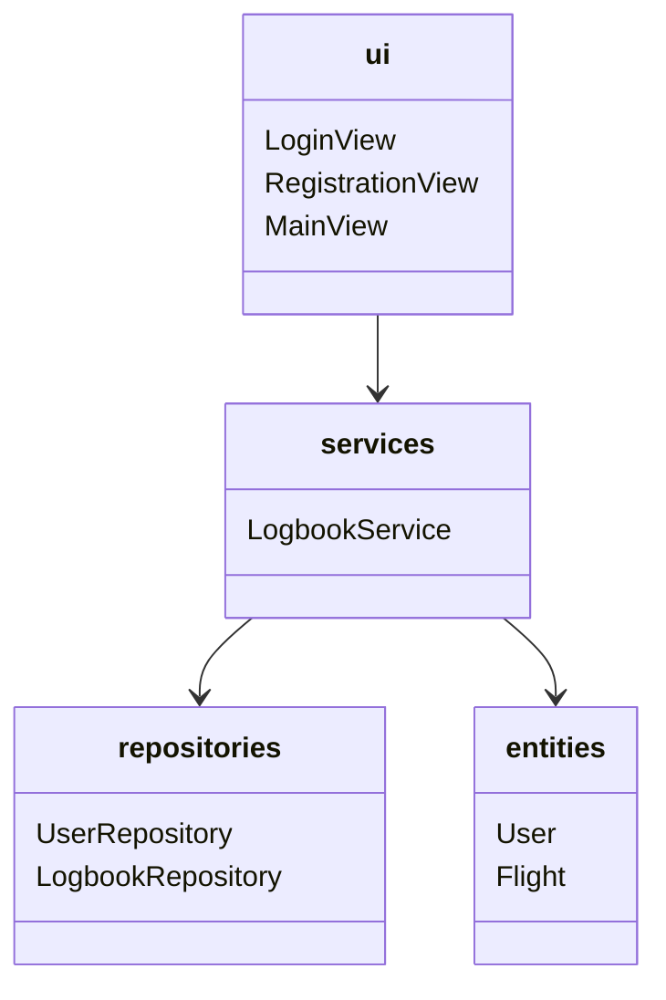
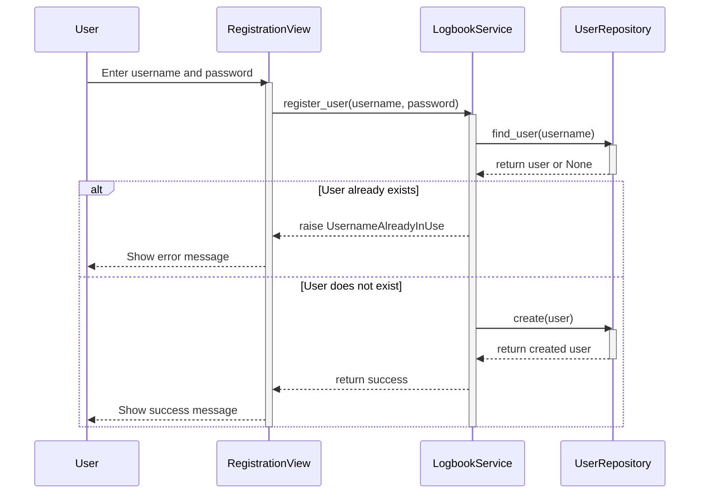

# Arkkitehtuuri

Kaaviossa **ui** vastaa käyttöliittymää ja sen eri näkymiä, **services** sisältää sovelluslogiikan, **repositories** tietokantaoperaatiot jaettuna *käyttäjä-* sekä *lokikirjatoimintoihin* ja **entities** sisältää objektit *User* ja *Flight*, jotka kuvaavat *käyttäjää* ja käyttäjän lentämää *lentoa*.

## Käyttöliittymä

Sovelluksessa on kolme sivua:

 - Kirjautumissivu
 - Rekisteröitymissivu
 - Pääsivu

Kirjautumissivu on etusivu, josta voi siirtyä kirjautumalla pääsivulle, tai jos haluaa luodan uuden käyttäjän, rekisteröitymissivulle. Pääsivulla on perusnäkymä, johon on listattu käyttäjän lisäämät lennot, sekä näkymä lentojen lisäämistä varten.

## Sovelluksen logiikka

Sovelluksen oleellisimmat luokat ovat *User* ja *Flight*. *User* kuvaa käyttäjää, ja *Flight* käyttäjän lentämää lentoa:

## Päätoiminnallisuudet

### Uuden käyttäjän rekisteröiminen

Tämä sekvenssikaavio kuvaa käyttäjän rekisteröimistä, ja sen alta löytyy tarkempi selitys tapahtumista:

Rekisteröitymissivulla käyttäjä syöttää käyttäjätunnuksen sekä salaasanan, ja klikkaa **"Register"**-painiketta. Tämä kutsuu `LogbookService`:n metodia `register_user`. Tämän jälkeen `LogbookService` kutsuu `UserRepository`:n metodia `find_user` jonka tarkoitus on varmistaa, ettei kyseinen käyttäjätunnus ole vielä käytössä. Jos käyttäjätunnus on vapaa, `UserRepository`:n metodi `create` luo uuden käyttäjän ja lisää sen tietokantaan.

### Lentojen lisääminen

Tämä sekvenssikaavio kuvaa lentojen lisäämistä, ja sen alta löytyy tarkempi selitys tapahtumista:

Kun pääsivulla painetaan **"Add flight"**-painiketta, kutsutaan MainViewin metodia `show_add_flight` näkymän vaihtamiseksi jotta lento voidaan lisätä. Käyttäjä syöttää lähtö- ja saapumiskentän, sekä lähtö- ja saapumisajat, ja painaa **"Add flight"**-painiketta, joka tarkistettuaan syötteen kutsuu `LogbookService`:n metodia `add_flight`. Tämä puolestaan tarkistaa onko kirjauduttu sisään, eli onko käyttäjä olemassa, ja luo `Flight`-olion käyttämällä aikaisempia syötteitä ja lisäämällä siihen lentäjän, käyttämällä `LogbookRepository`:n `create`-metodia. Tämä palauttaa tiedon LogbookService:lle ja siitä edelleen MainView:lle, joka vaihtaa näkymän takaisin normaaliksi metodilla `show_main_view`, joka vielä päivittää listan käyttäjän lentämistä lennoista metodilla `update_added_flights_list`.
