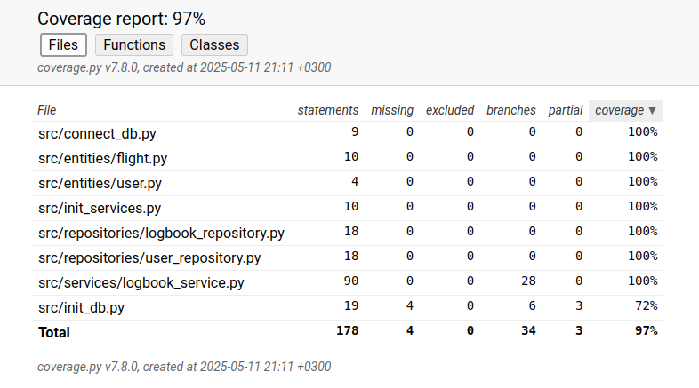

# Testausdokumentti

Sovelluksen testaus on suoritettu automatisoiduilla yksikkö- ja integraatiotesteillä.

### Asennus

Sovelluksen käyttöönotto on testattu seuraamalla [käyttöohjeissa](./kayttoohje.md) annettuja ohjeita. 
Testaus on tehty myös alustamatta tietokantaa, jolloin sovellus antaa varoituksen ja kysyy, halutaanko tietokanta alustaa.
Testaus on tehty Linuxia käyttäen.

### Sovelluksen toiminnallisuus

Kaikki sovelluksen toiminnallisuudet sekä mahdolliset virhetilanteet on testattu. Toiminnallisuudet löytyvät [määrittelydokumentista](./vaatimusmaarittely.md).

## Yksikkö- ja integraatiotestaus

### [Sovelluslogiikka](https://github.com/ilmari21/ot-harjoitustyo/blob/master/src/tests/services)

[LogbookService](https://github.com/ilmari21/ot-harjoitustyo/blob/master/src/services/logbook_service.py)-luokka testataan käyttämällä muistissa olevaa tietokantaa.

### [Repositoriot](https://github.com/ilmari21/ot-harjoitustyo/blob/master/src/tests/repositories)

Sovelluksen repositoriot [LogbookRepository](https://github.com/ilmari21/ot-harjoitustyo/blob/master/src/repositories/logbook_repository.py) sekä [UserRepository](https://github.com/ilmari21/ot-harjoitustyo/blob/master/src/repositories/user_repository.py) on niin ikään testattu käyttäen muistissa olevaa tietokantaa.

### Testauskattavuus

Sovelluksen testien haaraumakattavuus on 97%, `init-db`:n kattavuus ei saavuta 100%, sillä varsinaisen tietokannan alustus ei ole toivottua testauksessa.
[Käyttöliittymään](https://github.com/ilmari21/ot-harjoitustyo/blob/master/src/ui) liittyvät tiedostot jäivät testauksen ulkopuolelle.

