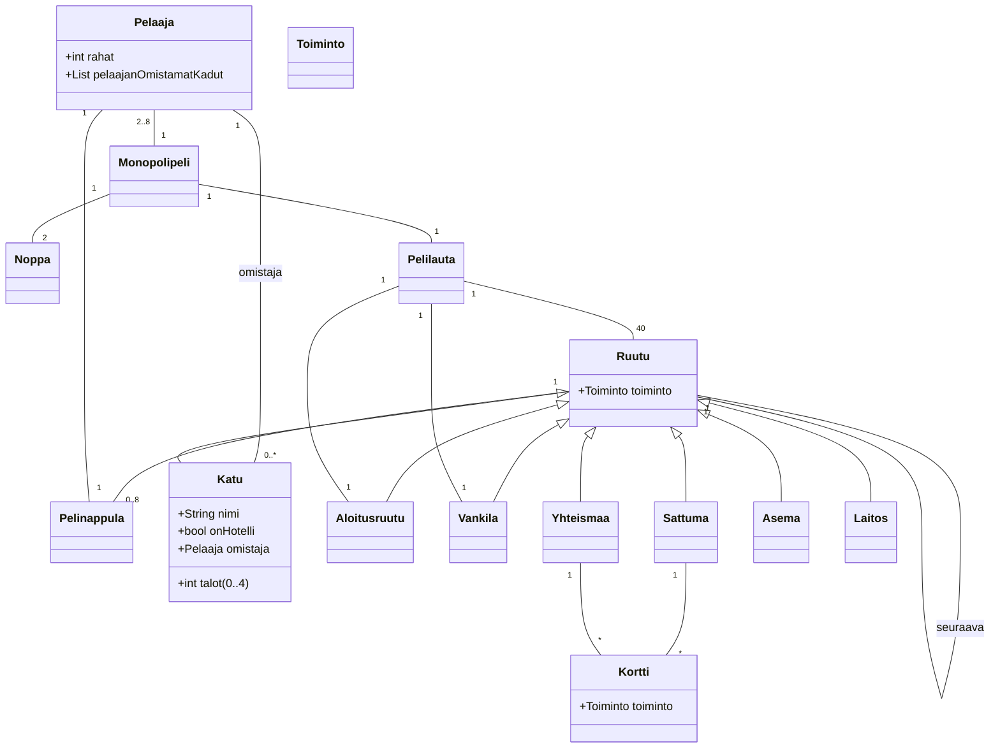

```mermaid
 classDiagram
    class Pelaaja {
        +int rahat
        +List<Katu> pelaajanOmistamatKadut
    }

    Monopolipeli "1" -- "2" Noppa
    Monopolipeli "1" -- "1" Pelilauta
    Pelilauta "1" -- "40" Ruutu
    Ruutu "1" -- "1" Ruutu : seuraava
    Ruutu "1" -- "0..8" Pelinappula
    Pelinappula "1" -- "1" Pelaaja
    Pelaaja "2..8" -- "1" Monopolipeli

    Pelaaja "1" -- "0..*" Katu : omistaja
    
    class Toiminto
    
    class Ruutu {
        +Toiminto toiminto
    }

    class Katu {
        +String nimi
        +int talot (0..4)
        +bool onHotelli
        +Pelaaja omistaja
    }
    
    class Kortti {
        +Toiminto toiminto
    }
    
    Ruutu <|-- Aloitusruutu
    Ruutu <|-- Vankila
    Ruutu <|-- Sattuma
    Ruutu <|-- Yhteismaa
    Ruutu <|-- Asema
    Ruutu <|-- Laitos
    Ruutu <|-- Katu
    
    Sattuma "1" -- "*" Kortti
    Yhteismaa "1" -- "*" Kortti

    Pelilauta "1" -- "1" Aloitusruutu
    Pelilauta "1" -- "1" Vankila
```
